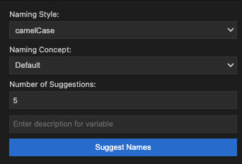

# 함수명 추천 확장 프로그램

api는 openai api 키를 사용함
모델은 gpt4o-mini

평균 사용 토큰은 아래와 같음
대략 만번 쓰면 200원 나온다
US$0.150 / 1M input tokens

```json
"usage": {
  "prompt_tokens": 85,
  "completion_tokens": 28,
  "total_tokens": 113
},
```

## preview


text 스타일과 컨셉을 잡을 수 있음
컨셉은 기본, 전문가, 학생, 힙스터 , 의미론적
현재 응답 결과가 ```json으로 넘어와서 예외처리 시켜줘야함

"content": "`json\n[\"previewVibes\", \"hipsterPreview\", \"chillPreview\", \"trendyPreview\", \"aestheticPreview\"]\n`"

## 개발 시 참고

engines 버전 맞추기 필수
커밋 해야 vsce package patch 이 동작함

npm run compile
vsce package patch

code --install-extension vscode-namer-0.0.4.vsix
